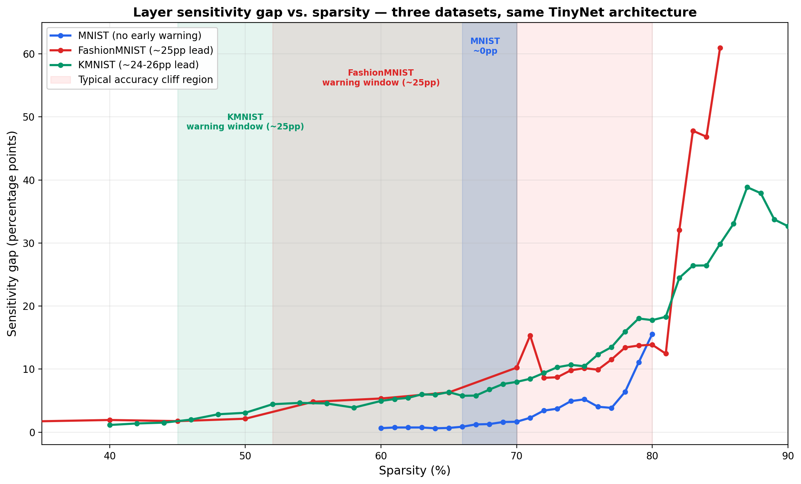

<div align="center">

# Layer Sensitivity as an Early-Warning Signal for Accuracy Collapse in TinyML Pruning

**An empirical study of dynamic sensitivity tracking across dataset complexity, on a 52K-parameter CNN**

[]()
[]()
[]()
[]()
[]()

**Hafsa Parker** — Independent Research, NUST PNEC
Supervised by Dr. Bilal · Research manuscript in preparation

[At a Glance](#at-a-glance) · [Key Findings](#key-findings) · [Literature Positioning](#literature-positioning) · [Methodology](#methodology) · [Results](#results) · [Limitations](#current-limitations) · [Future Work](#future-work)

</div>

---

<p align="center">
  
</p>

<p align="center"><em>Figure 1 — The layer sensitivity gap widens well before the accuracy cliff on FashionMNIST and KMNIST, but only at the cliff itself on MNIST. Same architecture, same training recipe, three datasets.</em></p>

---

## At a Glance

**Research Question**
Can the evolution of the layer sensitivity gap provide an early-warning signal before pruning-induced accuracy collapse?

**Main Observation**
Across three datasets using the same TinyNet architecture:
- MNIST: no measurable early warning
- FashionMNIST: ~25 percentage-point lead
- KMNIST: ~24–26 percentage-point lead

**Status**
⚠️ Preliminary evidence (3 datasets, single seed per dataset). Validation across additional seeds, datasets, and architectures is ongoing.

---

## Overview

Most pruning research treats layer sensitivity and the accuracy cliff as two separate problems: **measure sensitivity once, choose a pruning rate, prune.** This project asks a different question — one the literature has largely left open:

> **Does the sensitivity gap between layers, tracked *dynamically* as sparsity increases, provide early warning of an accuracy collapse — and does that depend on dataset complexity?**

Using a fixed 52,138-parameter CNN (**TinyNet**) and an identical training recipe, this study tracks the sensitivity gap across a full sparsity sweep on three datasets of increasing complexity — **MNIST, FashionMNIST, and KMNIST** — rather than measuring sensitivity as a single, one-time snapshot.

**Why TinyML specifically:** per-layer sensitivity analysis is often dismissed in the pruning literature as too computationally expensive to be practical (see [Literature Positioning](#literature-positioning)). At TinyML scale, that cost objection substantially weakens — making it possible to study sensitivity as a *continuous signal* rather than a cost to avoid.

---

## Key Findings

### 🔑 Finding 1 — The Sensitivity Gap Acts as a Potential Early-Warning Signal, But Only Sometimes

| Dataset | Gap departs baseline noise | Accuracy cliff | Lead time |
|:---|:---:|:---:|:---:|
| **MNIST** | ~66–67% | ~66–67% | **~0pp — no warning** |
| **FashionMNIST** | ~50–55% | ~79.6% | **~25pp** |
| **KMNIST** | ~44–46% | ~70–80% | **~24–26pp** |

The pattern is not a smooth gradient with dataset complexity — it resembles **two regimes**: no warning (MNIST) vs. substantial, similarly-sized warning (FashionMNIST, KMNIST). *This is a hypothesis from n=3 datasets, one seed each — not an established law.*

### 🔑 Finding 2 — Layer Sensitivity Is Not a Fixed Architectural Property

The most- and least-sensitive layer flips between datasets (e.g., FC2 most sensitive on MNIST, Conv1 most sensitive on FashionMNIST). Sensitivity depends on *what the network is learning*, not just its architecture.

### 🔑 Finding 3 — KMNIST Reveals a Staircase, Not a Cliff

A 41-probe fine sweep (40–90% sparsity, 2% steps) shows three distinct phases: an early descent (~45–54%), a flat shoulder (~54–68%), and a collapse zone (~70–80%) — with a **two-regime layer structure** underneath (FC2-dominated early, conv-dominated at collapse). See [full KMNIST methodology](#c-kmnist-fine-grained-sweep).

### 🔑 Finding 4 — Sensitivity-Aware Pruning Is Actionable, Not Just Descriptive

| Method | Sparsity | MNIST | FashionMNIST |
|:---|:---:|:---:|:---:|
| Uniform pruning | ~79% | 63.22% | 58.88% |
| Smart pruning (no retraining) | 79.3% | 92.39% | 75.06% |
| Smart pruning + retraining | 79.3% | **98.70%** | **89.11%** |

Using sensitivity data to allocate pruning rates per layer — rather than pruning uniformly — recovers near-baseline accuracy at ~79% sparsity, on both datasets tested.

---

## Literature Positioning

**Primary reference: EasiEdge** (Yu et al., *IEEE Internet of Things Journal*, 2021). EasiEdge explicitly frames per-layer sensitivity analysis as *a computational cost to eliminate*: layerwise pruning "require[s] prohibitive computation for per-layer sensitivity analysis," and a fixed pruning rate across layers risks damaging sensitive ones. Their solution — global, one-shot pruning via Information Gain — sidesteps layer-level analysis entirely.

**This work complicates that premise, at TinyML scale specifically.** At 52K parameters, per-layer sensitivity analysis is not just affordable once — it's affordable *repeatedly*, across a full sparsity sweep. To the best of my knowledge, existing filter-pruning methods primarily use sensitivity to determine pruning decisions rather than studying how it evolves throughout pruning — that gap (not *"how much should I prune,"* decided once, but *"how does the sensitivity gap change as pruning proceeds"*) is the question this work investigates.

| Paper | Venue | What it establishes | What remains open (this work) |
|:---|:---|:---|:---|
| Han et al. (2015) | NIPS | Layer-wise pruning sensitivity varies; foundational magnitude pruning | Sensitivity measured once, not tracked dynamically |
| Li et al. (2017) | ICLR | Filter-level L1-norm pruning + per-layer sensitivity to set budgets | Filter granularity, one-time measurement — closest ancestor method |
| EasiEdge (2021) | IEEE IoT Journal | Per-layer sensitivity is a cost to eliminate; global IG-based pruning avoids it | No TinyML-scale (<100K param) evaluation; no dynamic tracking |
| Zhao et al. (2023) | IEEE (conf.) | Cliff-like, layer-dependent decline on VGG16/CIFAR-10 | Single dataset/architecture; sensitivity sets a rate, not tracked as a gap |
| Pesce et al. (2026) | arXiv | Dataset-complexity-dependent cliff, whole-network level | No layer decomposition at all |
| TOP-RL (2026) | AAAI | Token/layer sensitivity generalizes to billion-parameter LVLMs | Different domain/scale; no dynamic gap-tracking |
| **This work** | — | **Sensitivity gap as a dynamic, cross-sparsity early-warning signal, at TinyML scale, across dataset complexity** | — |

---

## Methodology

**Architecture — TinyNet:** 2 conv layers (8, 16 filters, 3×3) + 2 FC layers (64 → 10). **52,138 parameters**, identical across every experiment — the only variable that changes between runs is the dataset.

**Training recipe (fixed across all experiments):** 5 epochs, Adam, lr=1e-3, batch size 64.

**Datasets:** MNIST (digits, baseline 99%), FashionMNIST (clothing, baseline 89.06%), KMNIST (Kuzushiji characters, baseline 92.77%).

#### A. Layer sensitivity measurement
For each layer, in isolation: prune that layer alone via L1 magnitude pruning to a target sparsity, evaluate accuracy, then **reload the fresh baseline checkpoint** before probing the next layer. No retraining, no carried-forward damage — each measurement is an independent, controlled probe of one layer's contribution.

#### B. Sensitivity gap
At each sparsity checkpoint: `gap = max(layer accuracy drop) − min(layer accuracy drop)` across the four layers. Tracked across a full sparsity sweep (not a single checkpoint) to observe how the gap evolves as pruning proceeds.

#### C. KMNIST fine-grained sweep
A 41-probe sweep from 40–90% sparsity (2% steps) was run to resolve the staircase structure at fine resolution — coarser sweeps on MNIST/FashionMNIST missed this structure entirely.

#### D. Smart pruning
Per-layer pruning rates set according to measured sensitivity (robust layers pruned harder, sensitive layers pruned lighter), compared against uniform pruning at matched total sparsity.

---

## Results

**Accuracy vs. sparsity (uniform pruning):**

| Sparsity | MNIST | FashionMNIST |
|:---:|:---:|:---:|
| 0% | 99.00% | 89.06% |
| 40% | 98.56% | 87.49% |
| 60% | 96.99% | 75.35% |
| 70% | 86.77% | 66.37% |
| 80% | 56.83% | 33.16% |

MNIST: late, sharp cliff (~66–67%). FashionMNIST/KMNIST: earlier, gradual, staircase-shaped decline.

**Full results, sweep data, and generated figures** are in the numbered notebooks — see [Repository Structure](#repository-structure).

---

## Current Limitations

- **Single seed per dataset.** All findings — the staircase shape, the two-regime layer split, the early-warning lead times — are from one training run each. Reproducibility across seeds has not yet been tested; this is the single highest-priority open item.
- **n=3 datasets, all 28×28 grayscale, 10-class.** MNIST, FashionMNIST, and KMNIST share the same input format and task structure. Generalization to genuinely different input types or tasks is untested.
- **No head-to-head comparison against existing methods' early-warning capability.** The claim is that this metric is largely unstudied elsewhere, not that it outperforms an existing benchmark — those are different claims, and only the former is currently supported.
- **Smart pruning validated on MNIST/FashionMNIST only**, not yet on KMNIST.
- **Unstructured pruning only.** Structured (filter-level) pruning is more directly deployment-relevant on real microcontroller hardware; whether the sensitivity-gap mechanism observed here transfers to structured pruning is untested and not assumed.

---

## Future Work

### Before July 20 (write-up checkpoint)
- [ ] IEEE survey literature review (pruning taxonomy, sensitivity-analysis coverage)
- [ ] Wall-clock compute cost for the sensitivity sweep
- [ ] Begin write-up — scoped honestly as hypothesis-stage, n=3

### Through September (experimental runway)
1. **A 4th/5th dataset**, differing in *kind* not just difficulty
2. **Extend smart pruning to KMNIST**
3. **Resolve the conv1@71% anomaly** (FashionMNIST) — mechanically verified, mechanism unexplained
4. **KMNIST finer-resolution sweep** around the shoulder-to-collapse transition
5. **Head-to-head comparison** against an existing method's early-warning capability (or lack thereof)

### Longer-horizon
- **θ₀ checkpoint / Lottery Ticket Hypothesis reinitialization test** (Frankle & Carbin) — requires a fresh training run preserving initialization weights
- **Ticket transfer across datasets** — partially addressed by Morcos et al. (2019); read before claiming novelty
- **Structured pruning** — acknowledged as future work per supervisor guidance; the sensitivity-gap mechanism observed here may not transfer directly to filter-level removal, which is itself an open question
- **Category-based cliff prediction** — group models by measurable properties (weight distribution, parameter count) to predict cliff location for unseen model/dataset pairs; blocked on measuring dataset complexity *a priori*

---

## Repository Structure

```
tinyml-pruning-study/
├── 01_baseline_training.ipynb              # TinyNet training on MNIST
├── 02_pruning_experiments.ipynb            # Uniform pruning, single-checkpoint sensitivity, smart pruning
├── 03_Fashionmnist_experiments.ipynb       # Cross-dataset generalisation experiments
├── 04_layer_sensitivity_checkpoints.ipynb  # MNIST + FashionMNIST full sensitivity-gap sweeps
├── 05_kmnist_experiments.ipynb             # KMNIST baseline, staircase sweep, 41-probe fine sweep
├── sensitivity_gap_three_datasets.png      # Combined gap-vs-sparsity chart (Figure 1)
├── tinynet_baseline_v1.pth                 # Saved MNIST baseline model
├── tinynet_fashion_baseline.pth            # Saved FashionMNIST baseline model
├── tinynet_kmnist_baseline.pth             # Saved KMNIST baseline model
└── README.md
```

---

## Foundational Papers

1. Han, Pool, Tran & Dally (2015) — *Learning both Weights and Connections for Efficient Neural Networks* (NIPS)
2. Frankle & Carbin (2019) — *The Lottery Ticket Hypothesis* (ICLR)
3. Blalock, Ortiz, Frankle & Guttag (2020) — *What is the State of Neural Network Pruning?* (MLSys)
4. Li, Kadav, Durdanovic, Samet & Graf (2017) — *Pruning Filters for Efficient ConvNets* (ICLR)
5. Hu, Gibson & Cano (2023) — *ICE-Pick: Iterative Cost-Efficient Pruning*
6. Yu et al. (2021) — *EasiEdge: A Novel Global DNN Pruning Method* (IEEE IoT Journal) — **primary reference**
7. Zhao et al. (2023) — *A Pruning Method with Adaptive Adjustment of Channel Pruning Rate* (IEEE conf.)
8. Pesce, He & Caldarelli (2026) — *Phase Transitions in Neural Networks Pruning*
9. Wang et al. (2026) — *TOP-RL* (AAAI-26)

---

## Research Updates

- 🔗 [LinkedIn — Smart Pruning vs Uniform Pruning](https://www.linkedin.com/feed/update/urn:li:activity:7469001090680754176/)
- 🔗 [LinkedIn — Does Dataset Complexity Determine Compression Limits?](https://www.linkedin.com/feed/update/urn:li:activity:7469719195765628928/)
- 🔗 LinkedIn — Sensitivity gap as an early-warning signal *(add link once posted)*

---

<div align="center">

*Independent research conducted as part of Master's study at NUST PNEC, supervised by Dr. Bilal.*
*PhD applications in TinyML / efficient deep learning — Fall 2026/2027 cycle.*

</div>
